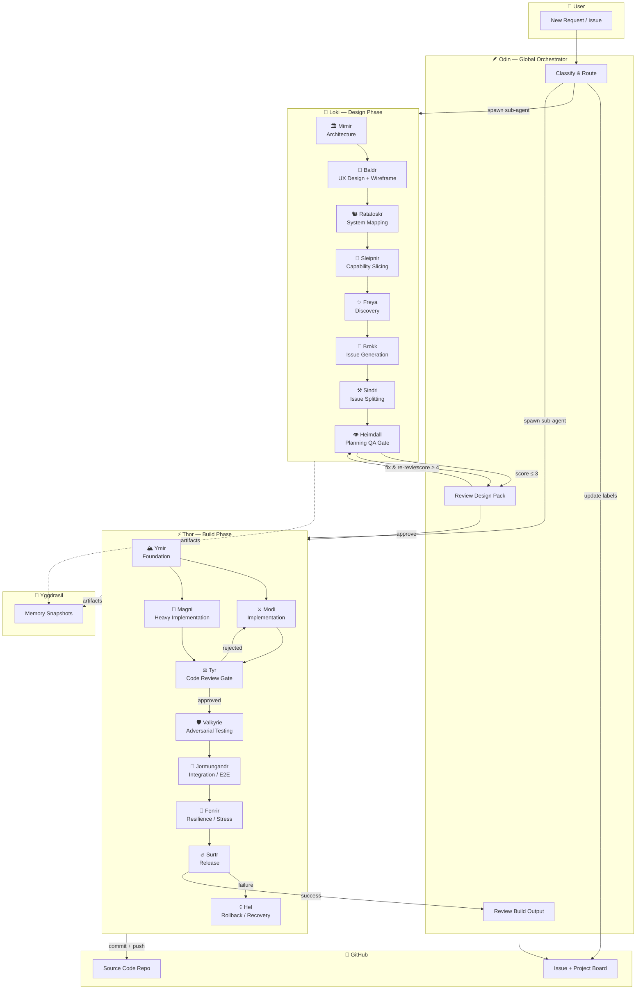
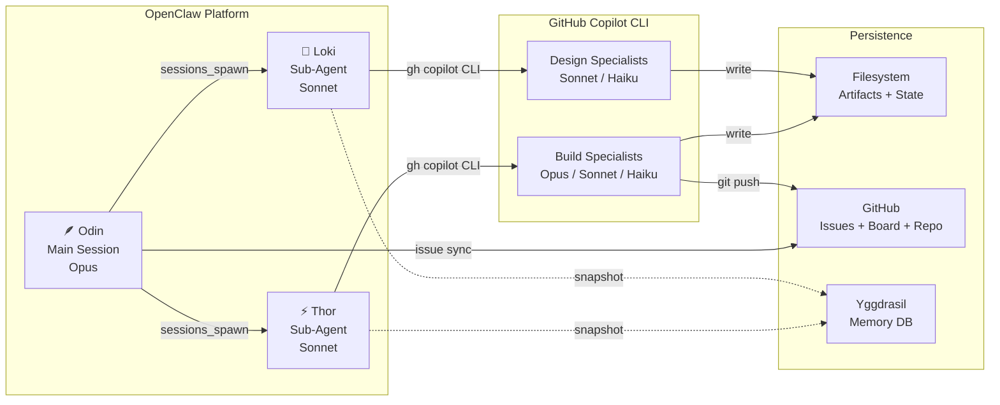
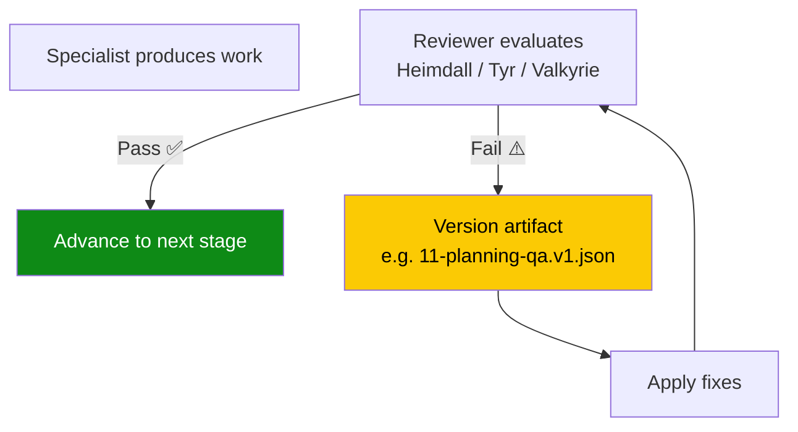
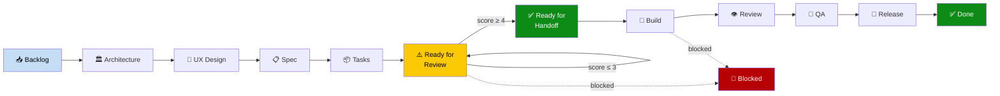

# Norse Agent System v2 — Flow Diagram

## Full System Flow

```mermaid
flowchart TD
    subgraph User["👤 User"]
        REQ[New Request / Issue]
    end

    subgraph Odin["🪶 Odin — Global Orchestrator"]
        CLASSIFY[Classify & Route]
        REVIEW_DESIGN[Review Design Pack]
        REVIEW_BUILD[Review Build Output]
    end

    subgraph Design["🐺 Loki — Design Phase"]
        direction TB
        MIMIR[🏛 Mimir<br/>Architecture]
        BALDR[🎨 Baldr<br/>UX Design + Wireframe]
        RATATOSKR[🐿️ Ratatoskr<br/>System Mapping]
        SLEIPNIR[🐴 Sleipnir<br/>Capability Slicing]
        FREYA[✨ Freya<br/>Discovery]
        BROKK[🔨 Brokk<br/>Issue Generation]
        SINDRI[⚒️ Sindri<br/>Issue Splitting]
        HEIMDALL[👁 Heimdall<br/>Planning QA Gate]
    end

    subgraph Build["⚡ Thor — Build Phase"]
        direction TB
        YMIR[🏔️ Ymir<br/>Foundation]
        MODI[⚔️ Modi<br/>Implementation]
        MAGNI[💪 Magni<br/>Heavy Implementation]
        TYR[⚖️ Tyr<br/>Code Review Gate]
        VALKYRIE[🛡️ Valkyrie<br/>Adversarial Testing]
        JORMUNGANDR[🐍 Jormungandr<br/>Integration / E2E]
        FENRIR[🐺 Fenrir<br/>Resilience / Stress]
        SURTR[🔥 Surtr<br/>Release]
        HEL[💀 Hel<br/>Rollback / Recovery]
    end

    subgraph Memory["🌳 Yggdrasil"]
        SNAP[Memory Snapshots]
    end

    subgraph GitHub["🐙 GitHub"]
        ISSUE[Issue + Project Board]
        REPO[Source Code Repo]
    end

    REQ --> CLASSIFY
    CLASSIFY -->|spawn sub-agent| Design
    MIMIR --> BALDR --> RATATOSKR --> SLEIPNIR
    SLEIPNIR --> FREYA --> BROKK --> SINDRI --> HEIMDALL

    HEIMDALL -->|score ≤ 3| REVIEW_DESIGN
    REVIEW_DESIGN -->|fix & re-review| HEIMDALL
    HEIMDALL -->|score ≥ 4| REVIEW_DESIGN
    REVIEW_DESIGN -->|approve| Build

    CLASSIFY -->|spawn sub-agent| Build
    YMIR --> MODI
    YMIR --> MAGNI
    MODI --> TYR
    MAGNI --> TYR
    TYR -->|approved| VALKYRIE
    TYR -->|rejected| MODI
    VALKYRIE --> JORMUNGANDR --> FENRIR --> SURTR
    SURTR -->|failure| HEL
    SURTR -->|success| REVIEW_BUILD
    REVIEW_BUILD --> ISSUE

    Design -.->|artifacts| SNAP
    Build -.->|artifacts| SNAP
    Build -->|commit + push| REPO
    CLASSIFY -->|update labels| ISSUE
```

## Execution Layer Diagram

```mermaid
flowchart LR
    subgraph OpenClaw["OpenClaw Platform"]
        ODIN["🪶 Odin<br/>Main Session<br/>Opus"]
        LOKI["🐺 Loki<br/>Sub-Agent<br/>Sonnet"]
        THOR["⚡ Thor<br/>Sub-Agent<br/>Sonnet"]
    end

    subgraph Copilot["GitHub Copilot CLI"]
        DS["Design Specialists<br/>Sonnet / Haiku"]
        BS["Build Specialists<br/>Opus / Sonnet / Haiku"]
    end

    subgraph Storage["Persistence"]
        FS["Filesystem<br/>Artifacts + State"]
        GH["GitHub<br/>Issues + Board + Repo"]
        YGG["Yggdrasil<br/>Memory DB"]
    end

    ODIN -->|sessions_spawn| LOKI
    ODIN -->|sessions_spawn| THOR
    LOKI -->|gh copilot CLI| DS
    THOR -->|gh copilot CLI| BS
    DS -->|write| FS
    BS -->|write| FS
    BS -->|git push| GH
    ODIN -->|issue sync| GH
    LOKI -.->|snapshot| YGG
    THOR -.->|snapshot| YGG
```

## Review Cycle Flow

```mermaid
flowchart TD
    WORK[Specialist produces work]
    REVIEW[Reviewer evaluates<br/>Heimdall / Tyr / Valkyrie]
    
    REVIEW -->|Pass ✅| NEXT[Advance to next stage]
    REVIEW -->|Fail ⚠️| VERSION[Version artifact<br/>e.g. 11-planning-qa.v1.json]
    VERSION --> FIX[Apply fixes]
    FIX --> REVIEW
    
    style NEXT fill:#0E8A16,color:#fff
    style VERSION fill:#FBCA04,color:#000
```

## GitHub Board Columns

```mermaid
flowchart LR
    BL[📥 Backlog] --> AR[🏛 Architecture]
    AR --> UX[🎨 UX Design]
    UX --> SP[📋 Spec]
    SP --> TA[📦 Tasks]
    TA --> RR[⚠️ Ready for<br/>Review]
    RR -->|score ≤ 3| RR
    RR -->|score ≥ 4| RH[✅ Ready for<br/>Handoff]
    RH --> BU[🔨 Build]
    BU --> RE[👁 Review]
    RE --> QA[🧪 QA]
    QA --> RL[🚀 Release]
    RL --> DN[✅ Done]
    
    RR -.->|blocked| BK[🚫 Blocked]
    BU -.->|blocked| BK
    
    style BL fill:#C5DEF5,color:#000
    style RR fill:#FBCA04,color:#000
    style RH fill:#0E8A16,color:#fff
    style DN fill:#0E8A16,color:#fff
    style BK fill:#B60205,color:#fff
```
